# Architecture and Class Relationships

This diagram shows the class relationships and inheritance hierarchy for the Azure OpenAI
LLM provider implementation.

```mermaid
classDiagram
    class BaseLLM {
        <<abstract>>
        +metadata: Metadata
        +chat(messages, stream, **kwargs)
        +achat(messages, stream, **kwargs)
    }

    class LLM {
        +system_prompt: str | None
        +parse(output_cls, prompt, **kwargs) Model
    }

    class FunctionCallingLLM {
        <<abstract>>
        +generate_tool_calls(messages, tools, **kwargs)
        +get_tool_calls_from_response(response, **kwargs)
    }

    class ChatToCompletion {
        <<mixin>>
        +complete(prompt, **kwargs)
        +acomplete(prompt, **kwargs)
    }

    class Client {
        +api_key: str | None
        +api_base: str | None
        +api_version: str | None
        +timeout: float
        +client: SyncOpenAI
        +async_client: AsyncOpenAI
        +_build_sync_client(**kwargs) SyncOpenAI
        +_build_async_client(**kwargs) AsyncOpenAI
        +_get_credential_kwargs(is_async) dict
    }

    class ModelMetadata {
        <<mixin>>
        +_get_model_name() str
        +_tokenizer: Encoding | None
    }

    class StructuredOutput {
        +parse(output_cls, prompt, **kwargs) Model
        +_should_use_structure_outputs() bool
    }

    class OpenAICompletions {
        +model: str
        +temperature: float
        +max_tokens: int | None
        +strict: bool
        +chat(messages, stream, **kwargs)
        +_prepare_chat_with_tools(tools, **kwargs)
        +get_tool_calls_from_response(response, **kwargs)
        -_chat(messages, **kwargs)
        -_stream_chat(messages, **kwargs)
    }

    class OpenAIResponses {
        +model: str
        +temperature: float
        +instructions: str | None
        +built_in_tools: list[dict] | None
        +chat(messages, stream, **kwargs)
        +_prepare_chat_with_tools(tools, **kwargs)
    }

    class AzureClient {
        <<mixin>>
        +engine: str
        +azure_endpoint: str | None
        +azure_deployment: str | None
        +use_azure_ad: bool
        +azure_ad_token_provider: Callable | None
        -_azure_ad_token: AccessToken | None
        +_build_sync_client(**kwargs) SyncAzureOpenAI
        +_build_async_client(**kwargs) AsyncAzureOpenAI
        +_get_credential_kwargs(is_async) dict
        +_get_model_kwargs(**kwargs) dict
        +_resolve_api_key() str
        #_validate_azure_env(data) dict
        #_reset_api_base_for_azure() Self
    }

    class AzureCompletions {
        +class_name() str
    }

    class AzureResponses {
        +class_name() str
    }

    class SyncAzureOpenAI {
        <<openai SDK>>
        +chat: ChatCompletions
        +responses: ResponsesResource
    }

    class AsyncAzureOpenAI {
        <<openai SDK>>
        +chat: AsyncChatCompletions
        +responses: AsyncResponsesResource
    }

    class AccessToken {
        +token: str
        +expires_on: int
    }

    class Metadata {
        +model_name: str
        +context_window: int
        +is_chat_model: bool
        +is_function_calling_model: bool
    }

    %% Inheritance - OpenAI base
    BaseLLM <|-- LLM
    LLM <|-- FunctionCallingLLM
    LLM <|-- StructuredOutput
    StructuredOutput --|> OpenAICompletions
    ModelMetadata --|> OpenAICompletions
    Client --|> OpenAICompletions
    ChatToCompletion --|> OpenAICompletions
    FunctionCallingLLM <|-- OpenAICompletions
    StructuredOutput --|> OpenAIResponses
    ModelMetadata --|> OpenAIResponses
    Client --|> OpenAIResponses
    ChatToCompletion --|> OpenAIResponses
    FunctionCallingLLM <|-- OpenAIResponses

    %% Azure extension
    AzureClient --|> AzureCompletions
    OpenAICompletions <|-- AzureCompletions
    AzureClient --|> AzureResponses
    OpenAIResponses <|-- AzureResponses

    %% Composition
    AzureClient o-- SyncAzureOpenAI : creates (lazy)
    AzureClient o-- AsyncAzureOpenAI : creates (lazy)
    AzureClient ..> AccessToken : manages (Azure AD)
    AzureCompletions ..> Metadata : provides
    AzureResponses ..> Metadata : provides

    note for AzureClient "Azure extension mixin:\n1. Factory method overrides\n2. Azure credential resolution\n3. Deployment name mapping\n4. Azure AD token refresh"
    note for AzureCompletions "Azure Chat Completions API:\nInherits all from OpenAI Completions\n+ Azure deployment + auth"
    note for AzureResponses "Azure Responses API:\nInherits all from OpenAI Responses\n+ Azure deployment + auth"
```



## Class Hierarchy

### Azure Completions

```
BaseLLM (abstract)
  +-- LLM
  |   +-- StructuredOutput
  +-- FunctionCallingLLM
  +-- ChatToCompletion
  +-- Client (SDK lifecycle)
  +-- ModelMetadata (tokenizer)
      +-- OpenAI Completions (full Chat Completions implementation)
          +-- AzureClient (mixin: factory overrides, Azure credentials)
              +-- Azure Completions (concrete)
```

### Azure Responses

```
BaseLLM (abstract)
  +-- LLM -> StructuredOutput
  +-- FunctionCallingLLM
  +-- ChatToCompletion
  +-- Client
  +-- ModelMetadata
      +-- OpenAI Responses (full Responses implementation)
          +-- AzureClient (mixin)
              +-- Azure Responses (concrete)
```

## Component Responsibilities

### AzureClient (Mixin)

**Azure Extension Layer**

- **Factory Method Overrides**: Creates `SyncAzureOpenAI` / `AsyncAzureOpenAI` instead of
  standard OpenAI clients
- **Credential Resolution**: Multi-source API key resolution (parameter, env, Azure AD)
- **Deployment Mapping**: Swaps `model` for `engine` in API calls
- **Azure AD Token Refresh**: Manages token lifecycle with 60s expiry buffer
- **Validation Pipeline**: Three-stage Pydantic validator chain

### Azure Completions

**Concrete Azure Chat Completions**

- Inherits all behavior from `OpenAI Completions`
- Adds Azure-specific initialization via `AzureClient`
- `class_name()` returns `"azure_openai_completions"`

### Azure Responses

**Concrete Azure Responses API**

- Inherits all behavior from `OpenAI Responses`
- Adds Azure-specific initialization via `AzureClient`
- `class_name()` returns `"azure_openai_responses"`

## Key Methods Overridden

### Factory Methods (from Client)

```python notest
# AzureClient overrides Client._build_sync_client
def _build_sync_client(self, **kwargs: Any) -> SyncAzureOpenAI:
    return SyncAzureOpenAI(**kwargs)

# AzureClient overrides Client._build_async_client
def _build_async_client(self, **kwargs: Any) -> AsyncAzureOpenAI:
    return AsyncAzureOpenAI(**kwargs)
```

### Credential Resolution (from Client)

```python notest
# AzureClient extends Client._get_credential_kwargs
def _get_credential_kwargs(self, is_async: bool = False) -> dict[str, Any]:
    self._resolve_api_key()  # Azure-specific key resolution
    kwargs = super()._get_credential_kwargs(is_async)
    kwargs.update({
        "azure_endpoint": self.azure_endpoint,
        "azure_deployment": self.azure_deployment,
        "azure_ad_token_provider": self.azure_ad_token_provider,
        "api_version": self.api_version,
    })
    return kwargs
```

### Model Kwargs (from OpenAI classes)

```python notest
# AzureClient overrides _get_model_kwargs
def _get_model_kwargs(self, **kwargs: Any) -> dict[str, Any]:
    all_kwargs = super()._get_model_kwargs(**kwargs)
    all_kwargs["model"] = self.engine  # Use deployment name
    return all_kwargs
```

## Design Patterns

### 1. Template Method Pattern

The `Client` base class defines `client` and `async_client` properties that call
`_build_sync_client` and `_build_async_client`. Azure overrides these factories to return
Azure-specific SDK clients.

### 2. Mixin Composition

`AzureClient` is a mixin that sits between the concrete class and the OpenAI parent:

```
AzureCompletions(AzureClient, OpenAICompletions)
```

MRO ensures `AzureClient._get_credential_kwargs()` is called before
`Client._get_credential_kwargs()`.

### 3. Multi-Stage Validation

```
1. _validate_azure_env (mode="before"): engine aliases, api_version, endpoint
2. _resolve_credentials (mode="after"): inherited API key resolution
3. _reset_api_base_for_azure (mode="after"): clear default OpenAI URL
```

## Integration Points

### With OpenAI Parent

```
Azure classes inherit from OpenAI parent:
  - All chat/completion/streaming logic
  - Tool calling and structured output
  - Response parsing (ChatMessageParser, etc.)
  - Retry logic with is_retryable
```

### With Azure SDK

```
Azure classes use Azure SDK clients:
  - SyncAzureOpenAI (sync operations)
  - AsyncAzureOpenAI (async operations)
  - azure-identity (DefaultAzureCredential for Azure AD)
```
