# Execution Flow and Method Calls

This diagram shows the complete workflow from initialization to execution of the Azure OpenAI
provider, highlighting Azure-specific credential resolution and client creation.

```mermaid
sequenceDiagram
    participant User
    participant AzureComp as Azure Completions
    participant AzureClient as AzureClient Mixin
    participant OpenAIComp as OpenAI Completions (inherited)
    participant Client as Client Mixin
    participant SDK as SyncAzureOpenAI
    participant AzureAPI as Azure OpenAI API
    participant AzureAD as Azure AD / Entra ID
    participant Parser as ChatMessageParser

    Note over User: Initialization Phase
    User->>AzureComp: __init__(engine, api_key, azure_endpoint, api_version, ...)
    activate AzureComp

    AzureComp->>AzureClient: _validate_azure_env (mode="before")
    activate AzureClient
    AzureClient->>AzureClient: Resolve engine from aliases
    Note over AzureClient: Try: engine, deployment_name,<br/>deployment_id, deployment
    AzureClient->>AzureClient: Validate api_version present
    AzureClient->>AzureClient: Resolve azure_endpoint from env
    AzureClient-->>AzureComp: Validated data dict
    deactivate AzureClient

    AzureComp->>OpenAIComp: Inherited __init__
    activate OpenAIComp
    OpenAIComp->>OpenAIComp: _validate_model (O1 checks)
    OpenAIComp->>OpenAIComp: _resolve_credentials
    OpenAIComp-->>AzureComp: OpenAI fields set
    deactivate OpenAIComp

    AzureComp->>AzureClient: _reset_api_base_for_azure
    activate AzureClient
    AzureClient->>AzureClient: Clear api_base if default or azure_endpoint set
    AzureClient-->>AzureComp: api_base = None
    deactivate AzureClient

    AzureComp-->>User: Azure Completions instance
    deactivate AzureComp

    Note over User: Chat with API Key Auth
    User->>AzureComp: chat(messages, **kwargs)
    activate AzureComp

    AzureComp->>AzureClient: _get_model_kwargs(**kwargs)
    activate AzureClient
    AzureClient->>OpenAIComp: super()._get_model_kwargs(**kwargs)
    activate OpenAIComp
    OpenAIComp-->>AzureClient: {"model": "gpt-4o", "temperature": 0.7, ...}
    deactivate OpenAIComp
    AzureClient->>AzureClient: all_kwargs["model"] = self.engine
    AzureClient-->>AzureComp: {"model": "my-deployment", ...}
    deactivate AzureClient

    AzureComp->>OpenAIComp: _chat(messages, **all_kwargs) [@retry]
    activate OpenAIComp

    OpenAIComp->>Client: Access self.client property
    activate Client
    Client->>Client: Check _client is None

    alt First call (lazy init)
        Client->>AzureClient: _get_credential_kwargs()
        activate AzureClient
        AzureClient->>AzureClient: _resolve_api_key()
        Note over AzureClient: use_azure_ad=False<br/>api_key from self.api_key or env
        AzureClient-->>Client: {api_key, azure_endpoint, azure_deployment,<br/>api_version, max_retries=0, ...}
        deactivate AzureClient

        Client->>AzureClient: _build_sync_client(**kwargs)
        activate AzureClient
        AzureClient->>SDK: SyncAzureOpenAI(**kwargs)
        activate SDK
        SDK-->>AzureClient: Azure SDK client
        deactivate SDK
        AzureClient-->>Client: SyncAzureOpenAI instance
        deactivate AzureClient
    end

    Client-->>OpenAIComp: SyncAzureOpenAI client
    deactivate Client

    OpenAIComp->>OpenAIComp: to_openai_message_dicts(messages)
    OpenAIComp->>SDK: client.chat.completions.create(**payload)
    activate SDK
    SDK->>AzureAPI: HTTPS POST to Azure endpoint
    activate AzureAPI
    AzureAPI-->>SDK: ChatCompletion response
    deactivate AzureAPI
    SDK-->>OpenAIComp: ChatCompletion object
    deactivate SDK

    OpenAIComp->>Parser: ChatMessageParser(response)
    activate Parser
    Parser-->>OpenAIComp: Message object
    deactivate Parser

    OpenAIComp-->>AzureComp: ChatResponse
    deactivate OpenAIComp
    AzureComp-->>User: ChatResponse
    deactivate AzureComp

    Note over User: Chat with Azure AD Auth
    User->>AzureComp: chat(messages) [use_azure_ad=True]
    activate AzureComp

    AzureComp->>OpenAIComp: _chat(messages, **kwargs) [@retry]
    activate OpenAIComp

    OpenAIComp->>Client: Access self.client property
    activate Client

    Client->>AzureClient: _get_credential_kwargs()
    activate AzureClient
    AzureClient->>AzureClient: _resolve_api_key()

    alt Custom token provider
        AzureClient->>AzureClient: azure_ad_token_provider()
        Note over AzureClient: Call user-provided callback
    else Auto refresh
        AzureClient->>AzureAD: refresh_openai_azure_ad_token(token)
        activate AzureAD
        AzureAD->>AzureAD: Check token expiry
        alt Token expired or None
            AzureAD->>AzureAD: DefaultAzureCredential()
            AzureAD->>AzureAD: get_token("cognitiveservices.azure.com/.default")
        end
        AzureAD-->>AzureClient: AccessToken(token, expires_on)
        deactivate AzureAD
    end

    AzureClient-->>Client: {api_key=token, azure_endpoint, ...}
    deactivate AzureClient

    Client->>AzureClient: _build_sync_client(**kwargs)
    activate AzureClient
    AzureClient-->>Client: SyncAzureOpenAI instance
    deactivate AzureClient

    Client-->>OpenAIComp: client
    deactivate Client

    OpenAIComp->>SDK: client.chat.completions.create(**payload)
    activate SDK
    SDK->>AzureAPI: HTTPS POST (with bearer token)
    activate AzureAPI
    AzureAPI-->>SDK: ChatCompletion
    deactivate AzureAPI
    SDK-->>OpenAIComp: ChatCompletion
    deactivate SDK

    OpenAIComp-->>AzureComp: ChatResponse
    deactivate OpenAIComp
    AzureComp-->>User: ChatResponse
    deactivate AzureComp

    Note over User: Streaming (with Azure filter chunks)
    User->>AzureComp: chat(messages, stream=True)
    activate AzureComp

    AzureComp->>OpenAIComp: _stream_chat(messages, **kwargs) [@retry(stream=True)]
    activate OpenAIComp
    OpenAIComp->>SDK: client.chat.completions.create(stream=True)
    activate SDK
    SDK->>AzureAPI: HTTPS POST (streaming)
    activate AzureAPI

    loop For each chunk
        AzureAPI-->>SDK: ChatCompletionChunk

        alt Empty choices (Azure content filter)
            SDK-->>OpenAIComp: chunk with choices=[]
            OpenAIComp->>OpenAIComp: Skip empty chunk
        else Normal chunk
            SDK-->>OpenAIComp: chunk with content delta
            OpenAIComp->>OpenAIComp: Parse delta, accumulate
            OpenAIComp-->>User: Yield ChatResponse(delta=...)
        end
    end

    deactivate AzureAPI
    deactivate SDK
    deactivate OpenAIComp
    deactivate AzureComp

    Note over User: Complete (via ChatToCompletion)
    User->>AzureComp: complete(prompt)
    activate AzureComp
    AzureComp->>AzureComp: ChatToCompletion adapter
    AzureComp->>AzureComp: chat([Message(USER, prompt)])
    Note over AzureComp: Follows chat flow above
    AzureComp-->>User: CompletionResponse
    deactivate AzureComp
```



## Key Execution Paths

### 1. Azure Chat (API Key)

```
User -> AzureCompletions.chat
  +-- AzureClient._get_model_kwargs (engine swap)
  +-- OpenAI._chat [@retry] (inherited)
  |   +-- AzureClient._get_credential_kwargs (API key)
  |   +-- AzureClient._build_sync_client -> SyncAzureOpenAI
  |   +-- to_openai_message_dicts
  |   +-- client.chat.completions.create
  |   +-- ChatMessageParser
  +-- Return ChatResponse
```

### 2. Azure Chat (Azure AD)

```
User -> AzureCompletions.chat
  +-- AzureClient._get_model_kwargs
  +-- OpenAI._chat [@retry]
  |   +-- AzureClient._get_credential_kwargs
  |   |   +-- _resolve_api_key
  |   |   |   +-- refresh_openai_azure_ad_token
  |   |   |   +-- DefaultAzureCredential.get_token
  |   +-- AzureClient._build_sync_client -> SyncAzureOpenAI
  |   +-- client.chat.completions.create (with bearer token)
  +-- Return ChatResponse
```

### 3. Azure Streaming

```
User -> AzureCompletions.chat(stream=True)
  +-- OpenAI._stream_chat [@retry(stream=True)]
  +-- client.chat.completions.create(stream=True)
  +-- For each chunk:
      +-- Skip if choices=[] (Azure content filter)
      +-- Parse delta, accumulate tool calls
      +-- Yield ChatResponse(delta=...)
```

### 4. Azure Complete

```
User -> AzureCompletions.complete
  +-- ChatToCompletion adapter
  +-- Wrap prompt as Message(USER)
  +-- Delegate to chat()
  +-- Return CompletionResponse
```

## Important Implementation Details

1. **Deployment Name Mapping**: `_get_model_kwargs` swaps `model` for `engine` in every request
2. **Azure Content Filters**: Streaming may produce empty `choices=[]` chunks that must be
   skipped
3. **SDK Retry Disabled**: `max_retries=0` on Azure SDK client, framework `@retry` handles it
4. **Azure AD Token Refresh**: Tokens refreshed when < 60 seconds until expiration
5. **Inherited Behavior**: All chat, streaming, tool calling, structured output logic comes
   from OpenAI parent classes unchanged
6. **Event-Loop Safety**: Inherited from Client mixin, works identically with Azure SDK clients
