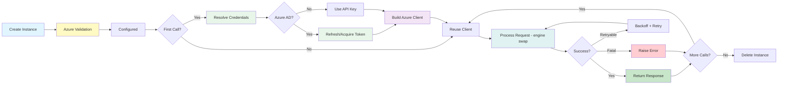

# Lifecycle and State Management

This diagram shows the complete lifecycle and state transitions of the Azure OpenAI LLM
provider, highlighting Azure-specific initialization and credential management.

```mermaid
stateDiagram-v2
    [*] --> Uninitialized

    Uninitialized --> AzureValidation: __init__(engine, api_key, azure_endpoint, api_version, ...)

    state AzureValidation {
        [*] --> ValidateAzureEnv

        state ValidateAzureEnv {
            [*] --> ResolveEngine
            ResolveEngine --> CheckAliases: Try aliases
            CheckAliases --> ValidateApiVersion: engine resolved
            CheckAliases --> EngineError: no alias found
            ValidateApiVersion --> ResolveEndpoint: api_version valid
            ValidateApiVersion --> VersionError: api_version missing
            ResolveEndpoint --> [*]: Azure env validated
        }

        ValidateAzureEnv --> InheritedValidation

        state InheritedValidation {
            [*] --> ValidateModel
            ValidateModel --> ResolveCredentials
            ResolveCredentials --> [*]
        }

        InheritedValidation --> ResetApiBase
        ResetApiBase --> [*]: api_base cleared
    }

    AzureValidation --> Configured: Validation passed
    AzureValidation --> ValidationError: Validation failed
    ValidationError --> [*]

    state Configured {
        [*] --> ClientNotCreated

        note right of ClientNotCreated
            Azure State:
            - engine: deployment name
            - azure_endpoint: resource URL
            - api_version: API version
            - use_azure_ad: bool
            - _azure_ad_token: None
            - _client: None
            - _async_client: None
        end note

        ClientNotCreated --> ClientInitialized: First chat/complete call

        state ClientInitialized {
            [*] --> ResolveApiKey

            state ResolveApiKey {
                [*] --> CheckAuthMode
                CheckAuthMode --> ApiKeyMode: use_azure_ad=False
                CheckAuthMode --> AzureADMode: use_azure_ad=True

                state ApiKeyMode {
                    [*] --> GetApiKey
                    GetApiKey --> [*]: api_key or AZURE_OPENAI_API_KEY env
                }

                state AzureADMode {
                    [*] --> CheckTokenProvider
                    CheckTokenProvider --> CustomProvider: provider set
                    CheckTokenProvider --> AutoRefresh: no provider

                    state CustomProvider {
                        [*] --> CallProvider
                        CallProvider --> [*]: token from callback
                    }

                    state AutoRefresh {
                        [*] --> CheckTokenExpiry
                        CheckTokenExpiry --> TokenValid: > 60s remaining
                        CheckTokenExpiry --> TokenExpired: <= 60s or None
                        TokenValid --> [*]: reuse token
                        TokenExpired --> AcquireToken
                        AcquireToken --> DefaultAzureCred
                        DefaultAzureCred --> [*]: fresh AccessToken
                    }

                    CustomProvider --> [*]
                    AutoRefresh --> [*]
                }

                ApiKeyMode --> [*]
                AzureADMode --> [*]
            }

            ResolveApiKey --> BuildClient

            state BuildClient {
                [*] --> CreateAzureSDK
                CreateAzureSDK --> [*]: SyncAzureOpenAI(max_retries=0)
            }

            BuildClient --> Idle

            note right of Idle
                Ready State:
                - _client: SyncAzureOpenAI
                - _async_client: None or AsyncAzureOpenAI
                - _azure_ad_token: AccessToken (if Azure AD)
            end note

            Idle --> ProcessingChat: chat(messages)
            Idle --> ProcessingComplete: complete(prompt)
            Idle --> ProcessingStream: chat(stream=True)
            Idle --> ProcessingAsync: achat(messages)
            Idle --> ProcessingTools: generate_tool_calls
            Idle --> ProcessingStructured: parse(output_cls)

            state ProcessingChat {
                [*] --> AzureModelKwargs
                AzureModelKwargs --> EngineSwap: model -> engine
                EngineSwap --> InheritedChat: OpenAI _chat [@retry]
                InheritedChat --> [*]
            }

            state ProcessingStream {
                [*] --> AzureStreamKwargs
                AzureStreamKwargs --> InheritedStream: OpenAI _stream_chat

                state StreamLoop {
                    [*] --> ReceiveChunk
                    ReceiveChunk --> FilterCheck{Empty choices?}
                    FilterCheck -->|Azure filter| SkipChunk
                    FilterCheck -->|Content| ParseDelta
                    SkipChunk --> ReceiveChunk
                    ParseDelta --> YieldResp
                    YieldResp --> CheckDone
                    CheckDone --> ReceiveChunk: not done
                    CheckDone --> [*]: done
                }

                InheritedStream --> StreamLoop
                StreamLoop --> [*]
            }

            state ProcessingAsync {
                [*] --> CheckEventLoop
                CheckEventLoop --> RecreateAzureClient: loop closed
                CheckEventLoop --> ReuseAzureClient: loop active
                RecreateAzureClient --> ResolveApiKeyAsync
                ResolveApiKeyAsync --> BuildAsyncAzure: AsyncAzureOpenAI
                ReuseAzureClient --> InheritedAChat
                BuildAsyncAzure --> InheritedAChat
                InheritedAChat --> [*]
            }

            ProcessingChat --> Idle: Return ChatResponse
            ProcessingComplete --> Idle: Return CompletionResponse
            ProcessingStream --> Idle: Stream complete
            ProcessingAsync --> Idle: Return ChatResponse
            ProcessingTools --> Idle: Return ChatResponse with tools
            ProcessingStructured --> Idle: Return Model instance

            Idle --> Error: Exception
            ProcessingChat --> Error: API error

            state Error {
                [*] --> ClassifyError
                ClassifyError --> RetryWithBackoff: Retryable
                ClassifyError --> RaiseImmediate: Non-retryable
                RetryWithBackoff --> [*]: Retry attempt
            }

            Error --> Idle: Retry succeeds or handled by caller
        }
    }

    Configured --> [*]: Delete instance
```

## State Transitions

### 1. Initialization -> AzureValidation -> Configured

```python notest
import os
from serapeum.azure_openai import Completions

llm = Completions(
    engine="my-gpt4o-deployment",
    api_key=os.environ.get("AZURE_OPENAI_API_KEY"),
    azure_endpoint=os.environ.get("AZURE_OPENAI_ENDPOINT"),
    api_version=os.environ.get("OPENAI_API_VERSION"),
)

# Azure Validation:
# 1. _validate_azure_env:
#    - engine = "my-gpt4o-deployment" (from parameter)
#    - api_version = "2024-02-01" (from env)
#    - azure_endpoint = "https://myres.openai.azure.com/" (from env)
#
# 2. Inherited validation:
#    - model = "gpt-35-turbo" (default)
#    - api_key = "azure-key" (from env)
#
# 3. _reset_api_base_for_azure:
#    - api_base = None (cleared)

# State: Configured
# - engine = "my-gpt4o-deployment"
# - azure_endpoint = "https://myres.openai.azure.com/"
# - api_version = "2024-02-01"
# - _client = None (lazy)
```

### 2. Configured -> ClientInitialized (with API Key)

```python notest
from serapeum.core.llms import Message, MessageRole, TextChunk

response = llm.chat([Message(role=MessageRole.USER, chunks=[TextChunk(content="Hello")])])

# Transition:
# 1. Access self.client -> None
# 2. _get_credential_kwargs():
#    - _resolve_api_key(): api_key = "azure-key"
#    - Build: {api_key, azure_endpoint, azure_deployment, api_version, max_retries=0}
# 3. _build_sync_client(**kwargs): SyncAzureOpenAI(...)
# 4. Store in _client

# State: ClientInitialized -> Idle
```

### 3. Configured -> ClientInitialized (with Azure AD)

```python notest
import os
from serapeum.azure_openai import Completions

llm = Completions(
    engine="my-deployment",
    use_azure_ad=True,
    azure_endpoint=os.environ.get("AZURE_OPENAI_ENDPOINT"),
    api_version=os.environ.get("OPENAI_API_VERSION"),
)

response = llm.chat(messages)

# Transition:
# 1. Access self.client -> None
# 2. _get_credential_kwargs():
#    - _resolve_api_key():
#      - use_azure_ad=True, no provider
#      - refresh_openai_azure_ad_token(None)
#        - token is None -> acquire new
#        - DefaultAzureCredential().get_token("cognitiveservices.azure.com/.default")
#        - Return AccessToken(token="bearer-...", expires_on=now+3600)
#      - _azure_ad_token = new token
#      - api_key = "bearer-..."
# 3. _build_sync_client(**kwargs): SyncAzureOpenAI(api_key="bearer-...")
```

### 4. Idle -> ProcessingChat -> Idle

```python notest
response = llm.chat(messages)

# Transition:
# 1. AzureModelKwargs: _get_model_kwargs()
#    - super()._get_model_kwargs() -> merge defaults + overrides
#    - all_kwargs["model"] = self.engine  (deployment swap)
# 2. EngineSwap: model="my-gpt4o-deployment"
# 3. InheritedChat: OpenAI._chat(messages, **all_kwargs) [@retry]
#    - to_openai_message_dicts
#    - client.chat.completions.create (Azure endpoint)
#    - ChatMessageParser
# 4. Return ChatResponse
```

### 5. Streaming with Azure Content Filters

```python notest
for chunk in llm.chat(messages, stream=True):
    print(chunk.delta)

# StreamLoop handles Azure filter chunks:
# 1. ReceiveChunk: chunk arrives
# 2. FilterCheck: choices empty?
#    - Yes (Azure content filter): SkipChunk -> next chunk
#    - No (has content): ParseDelta -> YieldResp
# 3. CheckDone: finish_reason?
```

## State Variables

### Azure Configuration State (Immutable after init)

```python notest
# Azure-specific (immutable after init)
self.engine: str = "my-gpt4o-deployment"
self.azure_endpoint: str | None = "https://myres.openai.azure.com/"
self.azure_deployment: str | None = "my-gpt4o-deployment"
self.api_version: str | None = "2024-02-01"
self.use_azure_ad: bool = False
self.azure_ad_token_provider: Callable | None = None

# Inherited from OpenAI (immutable after init)
self.model: str = "gpt-4o"
self.temperature: float = 0.7
self.max_tokens: int | None = None
self.api_key: str = "azure-key"
self.timeout: float = 60.0
self.max_retries: int = 3
```

### Azure Client State (Mutable)

```python notest
# Lazy-initialized
self._client: SyncAzureOpenAI | None = None
self._async_client: AsyncAzureOpenAI | None = None
self._async_client_loop: AbstractEventLoop | None = None

# Azure AD token (refreshed as needed)
self._azure_ad_token: AccessToken | None = None
```

## Concurrency Considerations

### Thread Safety

Same as OpenAI: instances are not thread-safe. Use separate instances per thread.

### Async Safety (Event-Loop Aware)

Inherited from Client mixin. Async client tracks event loop and recreates when loop is closed.
Azure AD tokens are refreshed per-client creation.

### Azure AD Token Thread Safety

```
Token refresh is NOT synchronized:
  - _azure_ad_token is shared state
  - Concurrent _resolve_api_key() calls may refresh simultaneously
  - DefaultAzureCredential is thread-safe internally

Recommendation:
  - Use separate instance per thread
  - Or provide your own thread-safe token_provider
```

## Lifecycle Diagram


