# Architecture and Class Relationships

This diagram shows the class relationships and inheritance hierarchy for the OpenAI LLM
provider implementation.

```mermaid
classDiagram
    class BaseLLM {
        <<abstract>>
        +metadata: Metadata
        +chat(messages, stream=false, **kwargs) ChatResponse | ChatResponseGen
        +achat(messages, stream=false, **kwargs) ChatResponse | ChatResponseAsyncGen
        +complete(prompt, stream=false, **kwargs) CompletionResponse | CompletionResponseGen
        +acomplete(prompt, stream=false, **kwargs) CompletionResponse | CompletionResponseAsyncGen
    }

    class LLM {
        +system_prompt: str | None
        +output_parser: BaseParser | None
        +structured_output_mode: StructuredOutputMode
        +predict(prompt, **kwargs) str
        +stream(prompt, **kwargs) TokenGen
        +parse(output_cls, prompt, **kwargs) Model
        +aparse(output_cls, prompt, **kwargs) Model
    }

    class FunctionCallingLLM {
        <<abstract>>
        +generate_tool_calls(messages, tools, stream=false, **kwargs)
        +agenerate_tool_calls(messages, tools, stream=false, **kwargs)
        +get_tool_calls_from_response(response, error_on_no_tool_call)
        #_prepare_chat_with_tools(messages, tools, **kwargs) dict
        #_validate_chat_with_tools_response(response, tools, **kwargs)
    }

    class ChatToCompletion {
        <<mixin>>
        +complete(prompt, **kwargs) CompletionResponse
        +acomplete(prompt, **kwargs) CompletionResponse
    }

    class Retry {
        +max_retries: int
    }

    class Client {
        +api_key: str | None
        +api_base: str | None
        +api_version: str | None
        +timeout: float
        +default_headers: dict | None
        -_client: SyncOpenAI | None
        -_async_client: AsyncOpenAI | None
        -_async_client_loop: AbstractEventLoop | None
        +client: SyncOpenAI
        +async_client: AsyncOpenAI
        +_get_credential_kwargs(is_async) dict
        +_build_sync_client(**kwargs) SyncOpenAI
        +_build_async_client(**kwargs) AsyncOpenAI
        +_needs_async_client_recreation() bool
    }

    class ModelMetadata {
        <<mixin>>
        +_get_model_name() str
        +_tokenizer: Encoding | None
    }

    class StructuredOutput {
        +parse(output_cls, prompt, **kwargs) Model
        +aparse(output_cls, prompt, **kwargs) Model
        +_should_use_structure_outputs() bool
        +_prepare_schema(llm_kwargs, schema) dict
    }

    class Completions {
        +model: str
        +temperature: float
        +max_tokens: int | None
        +logprobs: bool | None
        +top_logprobs: int
        +additional_kwargs: dict
        +strict: bool
        +reasoning_effort: str | None
        +modalities: list[str] | None
        +audio_config: dict | None
        +chat(messages, stream=false, **kwargs)
        +achat(messages, stream=false, **kwargs)
        +complete(prompt, stream=false, **kwargs)
        +acomplete(prompt, stream=false, **kwargs)
        +_prepare_chat_with_tools(tools, **kwargs) dict
        +get_tool_calls_from_response(response, **kwargs)
        -_chat(messages, **kwargs) ChatResponse
        -_stream_chat(messages, **kwargs) ChatResponseGen
        -_achat(messages, **kwargs) ChatResponse
        -_astream_chat(messages, **kwargs) ChatResponseAsyncGen
        +metadata: Metadata
        +class_name() str
    }

    class Responses {
        +model: str
        +temperature: float
        +top_p: float
        +max_output_tokens: int | None
        +reasoning_options: dict | None
        +instructions: str | None
        +track_previous_responses: bool
        +store: bool
        +built_in_tools: list[dict] | None
        +truncation: str
        +additional_kwargs: dict
        +strict: bool
        +chat(messages, stream=false, **kwargs)
        +achat(messages, stream=false, **kwargs)
        +_prepare_chat_with_tools(tools, **kwargs) dict
        -_chat(messages, **kwargs) ChatResponse
        -_stream_chat(messages, **kwargs) ChatResponseGen
        -_achat(messages, **kwargs) ChatResponse
        -_astream_chat(messages, **kwargs) ChatResponseAsyncGen
        +metadata: Metadata
        +class_name() str
    }

    class SyncOpenAI {
        <<openai SDK>>
        +chat: ChatCompletions
        +completions: Completions
        +responses: ResponsesResource
    }

    class AsyncOpenAI {
        <<openai SDK>>
        +chat: AsyncChatCompletions
        +completions: AsyncCompletions
        +responses: AsyncResponsesResource
    }

    class ChatMessageParser {
        +build() Message
    }

    class ToolCallAccumulator {
        +add_chunk(chunk)
        +get_tool_calls() list[ToolCallBlock]
    }

    class ResponsesOutputParser {
        +build() Message
    }

    class Metadata {
        +model_name: str
        +context_window: int
        +num_output: int
        +is_chat_model: bool
        +is_function_calling_model: bool
        +system_role: MessageRole
    }

    class Message {
        +role: MessageRole
        +chunks: list[ContentBlock]
        +additional_kwargs: dict
    }

    class ChatResponse {
        +message: Message
        +raw: dict | None
        +delta: str | None
        +additional_kwargs: dict
    }

    class CompletionResponse {
        +text: str
        +raw: dict | None
        +delta: str | None
        +additional_kwargs: dict
    }

    class BaseTool {
        <<protocol>>
        +metadata: ToolMetadata
        +call(**kwargs) ToolOutput
    }

    class CallableTool {
        +from_function(fn) CallableTool
        +from_model(model_cls) CallableTool
    }

    class TextCompletionLLM {
        -_llm: LLM
        -_prompt: BasePromptTemplate
        -_output_parser: PydanticParser
        +__call__(**kwargs) BaseModel
    }

    class ToolOrchestratingLLM {
        -_llm: FunctionCallingLLM
        -_prompt: BasePromptTemplate
        -_tools: list[BaseTool]
        +__call__(**kwargs) BaseModel | list[BaseModel]
    }

    %% Inheritance relationships
    BaseLLM <|-- LLM
    LLM <|-- FunctionCallingLLM
    LLM <|-- StructuredOutput
    Retry <|-- Client
    StructuredOutput --|> Completions
    ModelMetadata --|> Completions
    Client --|> Completions
    ChatToCompletion --|> Completions
    FunctionCallingLLM <|-- Completions
    StructuredOutput --|> Responses
    ModelMetadata --|> Responses
    Client --|> Responses
    ChatToCompletion --|> Responses
    FunctionCallingLLM <|-- Responses
    BaseTool <|.. CallableTool

    %% Composition relationships
    Client o-- SyncOpenAI : uses (lazy init)
    Client o-- AsyncOpenAI : uses (lazy init)
    Completions ..> Metadata : provides
    Completions ..> ChatResponse : produces
    Completions ..> CompletionResponse : produces
    Completions ..> ChatMessageParser : uses
    Completions ..> ToolCallAccumulator : uses (streaming)
    Responses ..> Metadata : provides
    Responses ..> ChatResponse : produces
    Responses ..> ResponsesOutputParser : uses
    ChatResponse o-- Message : contains

    %% Orchestrator relationships
    TextCompletionLLM o-- Completions : uses
    ToolOrchestratingLLM o-- Completions : uses
    ToolOrchestratingLLM o-- CallableTool : uses

    note for Completions "Chat Completions API:\n1. GPT-4o, GPT-4-turbo, GPT-3.5\n2. O1 reasoning models\n3. Legacy Completions endpoint\n4. Native JSON-schema structured output\n5. Tool/function calling"
    note for Responses "Responses API:\n1. O3, O4-mini, GPT-4o\n2. Built-in tools (web_search, etc.)\n3. Stateful conversations\n4. Reasoning options\n5. Server-side persistence"
    note for Client "SDK client lifecycle:\n- Lazy initialization\n- Event-loop safety\n- Credential resolution\n- Factory methods for Azure"
```



## Class Hierarchy

### Inheritance Chain (Completions)

```
BaseLLM (abstract)
  +-- LLM (adds prompting and structured outputs)
  |   +-- StructuredOutput (native JSON-schema)
  +-- FunctionCallingLLM (abstract, adds tool calling)
  +-- ChatToCompletion (mixin, completion via chat adapter)
  +-- Client(Retry, BaseModel) (SDK lifecycle and credentials)
  +-- ModelMetadata (tokenizer and model info)
      +-- Completions (concrete implementation)
```

### Inheritance Chain (Responses)

```
BaseLLM (abstract)
  +-- LLM -> StructuredOutput
  +-- FunctionCallingLLM
  +-- ChatToCompletion
  +-- Client(Retry, BaseModel)
  +-- ModelMetadata
      +-- Responses (concrete implementation)
```

## Component Responsibilities

### Completions

**Chat Completions API Implementation**

- **API Routing**: Routes to Chat Completions or legacy Completions endpoint
- **Request Handling**: Builds and executes chat/completion requests with model-specific params
- **Response Parsing**: Converts OpenAI SDK responses to typed models via ChatMessageParser
- **Tool Integration**: Prepares tools in nested OpenAI format, validates responses
- **Streaming Support**: Handles incremental response chunks with ToolCallAccumulator
- **O1 Support**: Forces temperature=1.0, renames max_tokens, supports reasoning_effort
- **Structured Output**: Native JSON-schema via response_format on supported models

### Responses

**Responses API Implementation**

- **Responses API**: Uses OpenAI's newer Responses endpoint
- **Built-in Tools**: Supports web_search, file_search, code_interpreter
- **Stateful Conversations**: track_previous_responses for multi-turn context
- **Reasoning**: Full reasoning_options support for O3/O4 models
- **Tool Format**: Uses flat tool-spec format (not nested)
- **Response Parsing**: Uses ResponsesOutputParser for output items

### Client (Mixin)

**SDK Client Lifecycle**

- **Lazy Initialization**: Creates clients on first use
- **Credential Resolution**: Resolves API key from env or parameter
- **Event-Loop Safety**: Tracks async event loop, recreates client on closed loops
- **Factory Methods**: `_build_sync_client` / `_build_async_client` for Azure override
- **SDK Retry Disabled**: `max_retries=0` to avoid double-retry with framework

### ModelMetadata (Mixin)

**Model Information**

- **Model Name**: Strips fine-tuning prefixes from model identifiers
- **Tokenizer**: Provides tiktoken Encoding for token counting
- **Context Window**: Looks up context window from model registry

### StructuredOutput (Mixin)

**Native JSON-Schema Structured Outputs**

- **parse() / aparse()**: Structured output via response_format or function-calling fallback
- **Model Detection**: Checks if model supports native JSON-schema
- **Schema Preparation**: Builds response_format payload using SDK helpers
- **Streaming**: Incremental JSON parsing during streaming

### Retry (Base)

**Retry Logic**

- **max_retries**: Configurable retry count (default: 3)
- **is_retryable**: OpenAI-specific exception classification
- **@retry decorator**: Applied to all API-calling methods

### Parser Classes

**Response Parsing**

- **ChatMessageParser**: Converts OpenAI ChatCompletionMessage to serapeum Message
- **ToolCallAccumulator**: Merges streaming tool-call fragments across chunks
- **ResponsesOutputParser**: Parses Responses API output items
- **LogProbParser**: Extracts log-probability data

## Design Patterns

### 1. Mixin Composition

```python notest
class Completions(StructuredOutput, ModelMetadata, Client, ChatToCompletion, FunctionCallingLLM):
    # Each mixin provides a focused capability
    # MRO ensures correct method resolution
    ...
```

### 2. Factory Method Pattern

```python notest
# Client base class defines factory methods
def _build_sync_client(self, **kwargs) -> SyncOpenAI:
    return SyncOpenAI(**kwargs)

# AzureOpenAI overrides to create Azure clients
def _build_sync_client(self, **kwargs) -> SyncAzureOpenAI:
    return SyncAzureOpenAI(**kwargs)
```

### 3. Decorator-Based Retry

```python notest
@retry(is_retryable, logger)
def _chat(self, messages, **kwargs) -> ChatResponse:
    response = self.client.chat.completions.create(...)
    return self._parse_response(response)
```

### 4. Protocol-Based Tools

```python notest
class BaseTool(Protocol):
    def call(self, **kwargs) -> ToolOutput: ...
```

## Integration Points

### With TextCompletionLLM

```
TextCompletionLLM uses Completions/Responses for:
  - Checking is_chat_model via metadata
  - Calling chat()
  - Getting raw text responses for parsing
```

### With ToolOrchestratingLLM

```
ToolOrchestratingLLM uses Completions/Responses for:
  - Tool-calling capabilities
  - generate_tool_calls() method
  - Tool call extraction from responses
```

### With External Packages

```
OpenAI provider depends on:
  - openai package (SyncOpenAI, AsyncOpenAI, SDK types)
  - tiktoken (tokenizer)
  - httpx (HTTP client)
  - pydantic (configuration and models)
  - serapeum.core (base classes and types)
```
