# Data Transformations and Validation

This diagram shows how data flows and transforms through the OpenAI LLM provider system.

```mermaid
flowchart TD
    Start([User Code]) --> Init{Initialize}

    Init --> SetConfig[Set Configuration]
    SetConfig --> StoreModel[Store model name]
    StoreModel --> StoreTemp[Store temperature]
    StoreTemp --> StoreKey[Resolve API key]
    StoreKey --> ValidateModel[Validate model - O1 checks]

    ValidateModel --> LookupModel[Model Registry Lookup]
    LookupModel --> SetContext[Set context_window]
    SetContext --> SetCaps[Set capabilities - chat, fn_calling, json_schema]
    SetCaps --> CreateMetadata[Create Metadata]
    CreateMetadata --> Ready([Instance Ready])

    Ready --> CallType{Call Type?}

    CallType -->|chat| ChatPath[Chat Path]
    CallType -->|complete| CompletePath[Complete Path]
    CallType -->|generate_tool_calls| ToolsPath[Tools Path]
    CallType -->|stream chat| StreamPath[Stream Path]
    CallType -->|parse| StructuredPath[Structured Output Path]

    %% Chat Path
    ChatPath --> BuildKwargs[_get_model_kwargs]
    BuildKwargs --> MergeDefaults[Merge defaults + additional_kwargs + overrides]
    MergeDefaults --> CheckO1{O1 model?}
    CheckO1 -->|Yes| RenameTokens[Rename max_tokens -> max_completion_tokens]
    CheckO1 -->|No| ConvertMessages
    RenameTokens --> ConvertMessages[to_openai_message_dicts]

    ConvertMessages --> ForEachMsg[For each Message]
    ForEachMsg --> ExtractRole[Extract role]
    ExtractRole --> ExtractChunks[Extract content from chunks]
    ExtractChunks --> HandleImages{Has images?}
    HandleImages -->|Yes| BuildContentArray[Build content array with image_url]
    HandleImages -->|No| BuildContentStr[Build content string]
    BuildContentArray --> HandleToolCalls{Has tool_calls?}
    BuildContentStr --> HandleToolCalls
    HandleToolCalls -->|Yes| AddToolCalls[Add tool_calls to message dict]
    HandleToolCalls -->|No| FinalizeMsg

    AddToolCalls --> FinalizeMsg[Finalize message dict]
    FinalizeMsg --> EnsureClient[Ensure client initialized]

    EnsureClient --> CheckClient{Client exists?}
    CheckClient -->|No| ResolveKey[_get_credential_kwargs]
    ResolveKey --> BuildClient[_build_sync_client]
    BuildClient --> StoreClient[Store in _client]
    CheckClient -->|Yes| SendRequest
    StoreClient --> SendRequest

    SendRequest --> RetryWrap[retry decorator wraps call]
    RetryWrap --> APICall[client.chat.completions.create]
    APICall --> ReceiveRaw[Receive ChatCompletion object]

    ReceiveRaw --> ParseResponse[ChatMessageParser]
    ParseResponse --> ExtractChoice[Extract choices 0 message]
    ExtractChoice --> ParseRole2[Parse role: assistant]
    ParseRole2 --> ParseContent2[Parse content blocks]
    ParseContent2 --> CheckToolResp{tool_calls present?}
    CheckToolResp -->|Yes| ParseToolCalls[Parse tool_calls -> ToolCallBlock]
    CheckToolResp -->|No| CreateMessage
    ParseToolCalls --> CreateMessage[Create Message object]

    CreateMessage --> ExtractTokens[_get_response_token_counts]
    ExtractTokens --> CreateChatResp[Create ChatResponse]
    CreateChatResp --> ReturnChat([Return ChatResponse])

    %% Complete Path
    CompletePath --> Adapter[ChatToCompletion adapter]
    Adapter --> WrapPrompt[Wrap prompt in Message role=USER]
    WrapPrompt --> DelegateChat[Delegate to chat method]
    DelegateChat --> ChatPath
    ReturnChat --> UnwrapAdapter[Adapter unwraps response]
    UnwrapAdapter --> ExtractText[Extract message.content as text]
    ExtractText --> CreateCompleteResp[Create CompletionResponse]
    CreateCompleteResp --> ReturnComplete([Return CompletionResponse])

    %% Tools Path
    ToolsPath --> PrepareTools[_prepare_chat_with_tools]
    PrepareTools --> ConvertToolsLoop[For each tool]
    ConvertToolsLoop --> ToOpenAITool[to_openai_tool]
    ToOpenAITool --> ExtractSchema[Extract fn_schema from metadata]
    ExtractSchema --> BuildToolDict[Build nested tool dict]
    BuildToolDict --> CheckStrict{strict mode?}
    CheckStrict -->|Yes| AddStrict[Set strict=true, additionalProperties=false]
    CheckStrict -->|No| ResolveChoice
    AddStrict --> ResolveChoice[resolve_tool_choice]
    ResolveChoice --> MergeToolKwargs[Merge tools into kwargs]
    MergeToolKwargs --> CallChatTools[Call chat with tools]
    CallChatTools --> SendRequestTools[API call with tools array]
    SendRequestTools --> ReceiveToolResp[Response with tool_calls]
    ReceiveToolResp --> ValidateToolResp[_validate_chat_with_tools_response]
    ValidateToolResp --> ReturnToolResp([Return ChatResponse with tools])

    %% Stream Path
    StreamPath --> BuildStreamKwargs[_get_model_kwargs with stream_options]
    BuildStreamKwargs --> SendStreamReq[API call with stream=True]
    SendStreamReq --> StreamLoop{For each chunk}

    StreamLoop --> ReceiveChunk[Receive ChatCompletionChunk]
    ReceiveChunk --> ParseDelta[Extract delta content]
    ParseDelta --> CheckToolChunk{tool_calls delta?}
    CheckToolChunk -->|Yes| AccumTools[ToolCallAccumulator.add_chunk]
    CheckToolChunk -->|No| CreateStreamResp
    AccumTools --> CreateStreamResp[Create ChatResponse with delta]
    CreateStreamResp --> YieldResp[Yield ChatResponse]
    YieldResp --> CheckFinish{finish_reason?}
    CheckFinish -->|None| StreamLoop
    CheckFinish -->|stop/tool_calls| EndStream([Stream Complete])

    %% Structured Output Path
    StructuredPath --> CheckSupport{_should_use_structure_outputs?}
    CheckSupport -->|Yes - native| PrepareSchema[_prepare_schema]
    PrepareSchema --> BuildResponseFmt[Build response_format payload]
    BuildResponseFmt --> CallWithFmt[chat with response_format]
    CallWithFmt --> ParseJSON[Parse response as JSON]
    ParseJSON --> ValidatePydantic[Validate with Pydantic model]
    ValidatePydantic --> ReturnModel([Return Model instance])

    CheckSupport -->|No - fallback| FnCallFallback[Function-calling fallback]
    FnCallFallback --> SetRequired[tool_choice = required]
    SetRequired --> ToolsPath

    %% Error handling
    APICall -->|Exception| RetryCheck{is_retryable?}
    RetryCheck -->|Yes + attempts left| RetryWrap
    RetryCheck -->|No| RaiseError([Raise Exception])

    %% Styling
    style Start fill:#e1f5ff
    style Ready fill:#e1f5ff
    style ReturnChat fill:#c8e6c9
    style ReturnComplete fill:#c8e6c9
    style ReturnToolResp fill:#c8e6c9
    style EndStream fill:#c8e6c9
    style ReturnModel fill:#c8e6c9
    style RaiseError fill:#ffcdd2
    style SendRequest fill:#fff9c4
    style SendRequestTools fill:#fff9c4
    style SendStreamReq fill:#fff9c4
    style RetryWrap fill:#ffecb3
```



## Data Transformation Examples

### 1. Initialization

```python notest
Input:
  Completions(model="gpt-4o-mini", api_key="sk-...", temperature=0.7)

Transformations:
  1. Store configuration:
     - model = "gpt-4o-mini"
     - temperature = 0.7
     - api_key = "sk-..."
     - max_tokens = None
     - strict = False

  2. Model registry lookup:
     - context_window = 128000
     - is_chat_model = True
     - is_function_calling_model = True
     - supports_json_schema = True

  3. Create metadata:
     - model_name = "gpt-4o-mini"
     - is_chat_model = True
     - is_function_calling_model = True
     - system_role = MessageRole.SYSTEM

Output:
  Completions instance with lazy-initialized client
```

### 2. Chat Request

```python notest
Input:
  messages = [Message(role=MessageRole.USER, chunks=[TextChunk(content="Say 'pong'.")])]
  kwargs = {"temperature": 0.2}

Transformations:
  1. _get_model_kwargs:
     {"model": "gpt-4o-mini", "temperature": 0.2}

  2. to_openai_message_dicts:
     [{"role": "user", "content": "Say 'pong'."}]

  3. SDK call:
     client.chat.completions.create(
       model="gpt-4o-mini",
       messages=[{"role": "user", "content": "Say 'pong'."}],
       temperature=0.2
     )

  4. SDK response (ChatCompletion):
     ChatCompletion(
       choices=[Choice(message=ChatCompletionMessage(
         role="assistant",
         content="Pong!"
       ))],
       usage=CompletionUsage(
         prompt_tokens=10,
         completion_tokens=2,
         total_tokens=12
       )
     )

  5. ChatMessageParser -> Message:
     Message(
       role=MessageRole.ASSISTANT,
       chunks=[TextChunk(content="Pong!")],
       additional_kwargs={}
     )

  6. ChatResponse:
     ChatResponse(
       message=<Message above>,
       additional_kwargs={
         "prompt_tokens": 10,
         "completion_tokens": 2,
         "total_tokens": 12
       }
     )

Output:
  ChatResponse with assistant message
```

### 3. Tool Schema Conversion

```python notest
Input:
  class Album(BaseModel):
      title: str
      artist: str
      songs: list[str]
  tool = CallableTool.from_model(Album)

Transformation (Chat Completions API -- nested format):
  {
    "type": "function",
    "function": {
      "name": "Album",
      "description": "A music album.",
      "parameters": {
        "type": "object",
        "properties": {
          "title": {"type": "string"},
          "artist": {"type": "string"},
          "songs": {"type": "array", "items": {"type": "string"}}
        },
        "required": ["title", "artist", "songs"]
      }
    }
  }

Transformation (Responses API -- flat format):
  {
    "type": "function",
    "name": "Album",
    "description": "A music album.",
    "parameters": {
      "type": "object",
      "properties": {
        "title": {"type": "string"},
        "artist": {"type": "string"},
        "songs": {"type": "array", "items": {"type": "string"}}
      },
      "required": ["title", "artist", "songs"]
    }
  }
```

### 4. Streaming Chat

```python notest
Input:
  messages = [Message(role=MessageRole.USER, chunks=[TextChunk(content="Count to 3")])]
  stream = True

Transformations:
  1. Build request with stream=True, stream_options={"include_usage": True}

  2. SDK returns chunk iterator

  3. For each chunk:
     Chunk 1: ChatCompletionChunk(choices=[{delta: {content: "1"}}])
       -> ChatResponse(delta="1", message=Message(chunks=[TextChunk(content="1")]))
       -> Yield

     Chunk 2: ChatCompletionChunk(choices=[{delta: {content: ", 2"}}])
       -> ChatResponse(delta=", 2", message=Message(chunks=[TextChunk(content=", 2")]))
       -> Yield

     Chunk 3: ChatCompletionChunk(choices=[{delta: {content: ", 3"}, finish_reason: "stop"}])
       -> ChatResponse(delta=", 3", message=Message(chunks=[TextChunk(content=", 3")]))
       -> Yield

     Chunk 4: ChatCompletionChunk(usage={prompt_tokens: 10, completion_tokens: 5})
       -> Final usage chunk (if stream_options.include_usage)

Output:
  Generator yielding ChatResponse objects
```

### 5. Structured Output (Native JSON-Schema)

```python notest
Input:
  output_cls = Person  # BaseModel with name: str, age: int
  prompt = "Create a fictional person"

Transformations:
  1. _should_use_structure_outputs():
     - model="gpt-4o-mini" in JSON_SCHEMA_MODELS -> True

  2. _prepare_schema():
     response_format = {
       "type": "json_schema",
       "json_schema": {
         "name": "Person",
         "strict": True,
         "schema": {
           "type": "object",
           "properties": {
             "name": {"type": "string"},
             "age": {"type": "integer"}
           },
           "required": ["name", "age"],
           "additionalProperties": false
         }
       }
     }

  3. SDK call with response_format
  4. Parse response content as JSON: {"name": "Alice", "age": 30}
  5. Validate with Pydantic: Person(name="Alice", age=30)

Output:
  Person(name="Alice", age=30)
```

## Validation Points

### 1. Configuration Validation

- **model**: Must be non-empty string; O1 models force temperature=1.0
- **temperature**: Must be float in range [0.0, 2.0]
- **timeout**: Must be float >= 0
- **api_key**: Resolved from env or parameter; required for API calls

### 2. Message Validation

- **messages**: Must be non-empty list
- **role**: Must be valid MessageRole enum
- **content**: String, list of content blocks, or empty for tool calls

### 3. Tool Validation

- **tools**: Must be list of BaseTool instances
- **tool.metadata**: Must have name, description, fn_schema
- **fn_schema**: Must be valid JSON schema dict
- **strict mode**: Adds additionalProperties=false to parameters

### 4. Response Validation

- **HTTP status**: Non-retryable errors raised immediately
- **Retryable errors**: Retried with exponential backoff
- **Choice extraction**: Must have at least one choice
- **Tool calls**: JSON parsing with fallback on failure

## Error Handling

### Retryable Errors

```
APIConnectionError -> Retry with backoff
APITimeoutError -> Retry with backoff
429 RateLimitError -> Retry with backoff
500 InternalServerError -> Retry with backoff
502/503/504 Gateway errors -> Retry with backoff
408 Request Timeout -> Retry with backoff
```

### Non-Retryable Errors

```
401 AuthenticationError -> Raise immediately
400 BadRequestError -> Raise immediately
403 PermissionDeniedError -> Raise immediately
404 NotFoundError -> Raise immediately
```

## Data Flow Summary

```
User Input
  |
Configuration / Validation
  |
Model Kwargs Building (merge defaults + overrides)
  |
Message Conversion (to_openai_message_dicts)
  |
Client Initialization (lazy, with credential resolution)
  |
Retry Wrapper (is_retryable classification)
  |
SDK API Call (HTTPS to OpenAI)
  |
Raw Response (ChatCompletion / Response object)
  |
Response Parsing (ChatMessageParser / ResponsesOutputParser)
  |
Token Count Extraction
  |
Typed Response (ChatResponse / CompletionResponse)
  |
User Output
```
