# Execution Flow and Method Calls

This diagram shows the complete workflow from initialization to execution of the OpenAI
provider classes.

```mermaid
sequenceDiagram
    participant User
    participant Completions
    participant Client as Client mixin
    participant SDK as SyncOpenAI / AsyncOpenAI
    participant API as OpenAI API
    participant Parser as ChatMessageParser
    participant TextCompletionLLM
    participant ToolOrchestratingLLM

    Note over User: Initialization Phase
    User->>Completions: __init__(model, api_key, temperature, ...)
    activate Completions

    Completions->>Completions: _validate_model()
    Note over Completions: O1: force temperature=1.0<br/>Responses-only: reject

    Completions->>Completions: _resolve_credentials()
    Note over Completions: Resolve api_key from env<br/>or parameter

    Completions->>Completions: Model Registry lookup
    Note over Completions: context_window, is_chat_model,<br/>is_function_calling_model,<br/>json_schema support

    Completions->>Completions: Set _client=None, _async_client=None
    Completions-->>User: Completions instance
    deactivate Completions

    Note over User: Direct Usage -- Chat Method
    User->>Completions: chat(messages, **kwargs)
    activate Completions

    Completions->>Completions: _get_model_kwargs(**kwargs)
    Note over Completions: Merge: model defaults +<br/>additional_kwargs + overrides

    Completions->>Completions: _chat(messages, **all_kwargs) [@retry]
    Completions->>Client: Access self.client property
    activate Client
    Client->>Client: _get_credential_kwargs()
    Client->>Client: _build_sync_client(**cred_kwargs)
    Note over Client: SyncOpenAI(api_key=...,<br/>max_retries=0, timeout=...)
    Client-->>Completions: SyncOpenAI instance
    deactivate Client

    Completions->>Completions: to_openai_message_dicts(messages)
    Note over Completions: Convert serapeum Messages<br/>to OpenAI dict format

    Completions->>SDK: client.chat.completions.create(**payload)
    activate SDK
    SDK->>API: HTTPS POST /v1/chat/completions
    activate API
    API-->>SDK: ChatCompletion response
    deactivate API
    SDK-->>Completions: ChatCompletion object
    deactivate SDK

    Completions->>Parser: ChatMessageParser(response.choices[0].message)
    activate Parser
    Parser->>Parser: Extract role, content, tool_calls
    Parser-->>Completions: Message object
    deactivate Parser

    Completions->>Completions: _get_response_token_counts(response)
    Completions-->>User: ChatResponse
    deactivate Completions

    Note over User: Direct Usage -- Complete Method
    User->>Completions: complete(prompt, **kwargs)
    activate Completions

    Completions->>Completions: ChatToCompletion adapter
    Note over Completions: Wrap prompt as Message(USER)<br/>Delegate to chat()

    Completions->>Completions: chat([Message(USER, prompt)])
    Note over Completions: Follows chat flow above

    Completions->>Completions: Extract text from ChatResponse
    Completions-->>User: CompletionResponse
    deactivate Completions

    Note over User: Streaming Usage
    User->>Completions: chat(messages, stream=True)
    activate Completions

    Completions->>Completions: _stream_chat(messages, **kwargs) [@retry(stream=True)]
    Completions->>SDK: client.chat.completions.create(stream=True)
    activate SDK
    SDK->>API: HTTPS POST (streaming)
    activate API

    loop For each chunk
        API-->>SDK: ChatCompletionChunk
        SDK-->>Completions: chunk
        Completions->>Completions: Parse delta, accumulate tool_calls
        Note over Completions: ToolCallAccumulator merges<br/>tool call fragments
        Completions-->>User: Yield ChatResponse(delta=...)
    end

    deactivate API
    deactivate SDK
    deactivate Completions

    Note over User: Tool Calling
    User->>Completions: generate_tool_calls(messages, tools, **kwargs)
    activate Completions

    Completions->>Completions: _prepare_chat_with_tools(tools, message, ...)
    Note over Completions: Convert each tool to OpenAI format<br/>Resolve tool_choice<br/>Build messages list

    Completions->>Completions: chat(messages, tools=..., tool_choice=...)
    Note over Completions: Follows chat flow with tools param

    Completions->>SDK: client.chat.completions.create(tools=[...])
    activate SDK
    SDK->>API: HTTPS POST with tools
    activate API
    API-->>SDK: Response with tool_calls
    deactivate API
    SDK-->>Completions: ChatCompletion with tool_calls
    deactivate SDK

    Completions->>Parser: Parse tool_calls into ToolCallBlocks
    activate Parser
    Parser-->>Completions: Message with tool_calls
    deactivate Parser

    Completions->>Completions: _validate_chat_with_tools_response
    Completions-->>User: ChatResponse with tool_calls
    deactivate Completions

    Note over User: Structured Output (Native JSON-Schema)
    User->>Completions: parse(output_cls=Person, prompt="...")
    activate Completions

    Completions->>Completions: _should_use_structure_outputs()
    Note over Completions: Check model supports<br/>JSON-schema response_format

    alt Native JSON-schema supported
        Completions->>Completions: _prepare_schema(kwargs, Person)
        Note over Completions: Build response_format payload
        Completions->>SDK: client.chat.completions.create(response_format=...)
        activate SDK
        SDK->>API: HTTPS POST with response_format
        activate API
        API-->>SDK: JSON response matching schema
        deactivate API
        SDK-->>Completions: ChatCompletion
        deactivate SDK
        Completions->>Completions: Parse JSON, validate with Pydantic
    else Function-calling fallback
        Completions->>Completions: tool_choice="required"
        Completions->>Completions: generate_tool_calls with schema as tool
    end

    Completions-->>User: Person instance
    deactivate Completions

    Note over User: Usage with TextCompletionLLM
    User->>TextCompletionLLM: __init__(parser, prompt, llm=Completions)
    activate TextCompletionLLM
    TextCompletionLLM-->>User: text_llm instance
    deactivate TextCompletionLLM

    User->>TextCompletionLLM: __call__(value="input")
    activate TextCompletionLLM
    TextCompletionLLM->>Completions: Check metadata.is_chat_model
    activate Completions
    Completions-->>TextCompletionLLM: True
    deactivate Completions
    TextCompletionLLM->>TextCompletionLLM: Format prompt with variables
    TextCompletionLLM->>Completions: chat(formatted_messages)
    activate Completions
    Completions->>API: HTTPS POST /v1/chat/completions
    activate API
    API-->>Completions: JSON response
    deactivate API
    Completions-->>TextCompletionLLM: ChatResponse
    deactivate Completions
    TextCompletionLLM->>TextCompletionLLM: PydanticParser.parse(content)
    TextCompletionLLM-->>User: DummyModel instance
    deactivate TextCompletionLLM

    Note over User: Usage with ToolOrchestratingLLM
    User->>ToolOrchestratingLLM: __init__(output_cls=Album, prompt, llm=Completions)
    activate ToolOrchestratingLLM
    ToolOrchestratingLLM->>ToolOrchestratingLLM: Create CallableTool from Album
    ToolOrchestratingLLM-->>User: tools_llm instance
    deactivate ToolOrchestratingLLM

    User->>ToolOrchestratingLLM: __call__(topic="rock")
    activate ToolOrchestratingLLM
    ToolOrchestratingLLM->>ToolOrchestratingLLM: Format prompt
    ToolOrchestratingLLM->>Completions: generate_tool_calls(messages, tools=[album_tool])
    activate Completions
    Completions->>API: HTTPS POST with tools
    activate API
    API-->>Completions: Response with tool_calls
    deactivate API
    Completions-->>ToolOrchestratingLLM: ChatResponse(tool_calls=[...])
    deactivate Completions
    ToolOrchestratingLLM->>ToolOrchestratingLLM: Execute tool with arguments
    Note over ToolOrchestratingLLM: Create Album instance<br/>from tool arguments
    ToolOrchestratingLLM-->>User: Album instance
    deactivate ToolOrchestratingLLM

    Note over User: Async Usage
    User->>Completions: await achat(messages)
    activate Completions
    Completions->>Client: Access self.async_client property
    activate Client
    Client->>Client: Check event loop safety
    Note over Client: Recreate if loop closed
    Client->>Client: _build_async_client(**cred_kwargs)
    Client-->>Completions: AsyncOpenAI instance
    deactivate Client
    Completions->>SDK: await async_client.chat.completions.create()
    activate SDK
    SDK->>API: HTTPS POST (async)
    activate API
    API-->>SDK: ChatCompletion
    deactivate API
    SDK-->>Completions: ChatCompletion
    deactivate SDK
    Completions->>Parser: ChatMessageParser(message)
    activate Parser
    Parser-->>Completions: Message
    deactivate Parser
    Completions-->>User: ChatResponse
    deactivate Completions
```



## Key Execution Paths

### 1. Direct Chat Call

```
User -> Completions.chat
  +-- _get_model_kwargs (merge params)
  +-- _chat (decorated with @retry)
  +-- to_openai_message_dicts (convert messages)
  +-- client.chat.completions.create
  +-- ChatMessageParser (parse response)
  +-- _get_response_token_counts
  +-- Return ChatResponse
```

### 2. Complete Call (via ChatToCompletion)

```
User -> Completions.complete
  +-- ChatToCompletion adapter
  +-- Convert prompt to Message(role=USER)
  +-- Delegate to chat()
  +-- Return CompletionResponse
```

### 3. Tool Calling

```
User -> Completions.generate_tool_calls
  +-- _prepare_chat_with_tools
  |   +-- to_openai_tool for each tool (nested format)
  |   +-- resolve_tool_choice
  +-- chat(messages, tools=..., tool_choice=...)
  +-- _validate_chat_with_tools_response
  +-- Return ChatResponse with tool_calls
```

### 4. Structured Output (Native)

```
User -> Completions.parse(output_cls, prompt)
  +-- _should_use_structure_outputs()
  +-- If supported: _prepare_schema -> chat with response_format
  +-- If not: function-calling fallback via generate_tool_calls
  +-- Return Model instance
```

### 5. Streaming

```
User -> Completions.chat(stream=True)
  +-- _stream_chat (decorated with @retry(stream=True))
  +-- client.chat.completions.create(stream=True)
  +-- For each chunk:
      +-- Parse delta content
      +-- ToolCallAccumulator.add_chunk (if tool_calls)
      +-- Yield ChatResponse(delta=...)
```

### 6. Async with Event-Loop Safety

```
User -> await Completions.achat(messages)
  +-- Access self.async_client property
  |   +-- Check _needs_async_client_recreation()
  |   +-- If loop closed: recreate async client
  +-- await async_client.chat.completions.create()
  +-- ChatMessageParser
  +-- Return ChatResponse
```

## Important Implementation Details

1. **Lazy Client Initialization**: SDK client created on first use, not during `__init__`
2. **SDK Retry Disabled**: `max_retries=0` on SDK client; framework `@retry` handles retries
3. **Event-Loop Safety**: Async client tracks event loop, recreates when loop is closed
4. **O1 Model Handling**: Temperature forced to 1.0, max_tokens renamed to max_completion_tokens
5. **Dual Tool Formats**: Chat Completions uses nested format, Responses uses flat format
6. **Inner gen() Pattern**: Async streaming methods use inner `gen()` coroutine for retry safety
7. **ToolCallAccumulator**: Streaming tool calls are accumulated across chunks before yielding
8. **Model Registry**: YAML-based registry for context windows and capability detection
