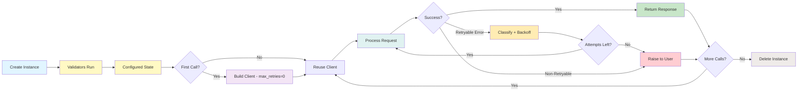

# Lifecycle and State Management

This diagram shows the complete lifecycle and state transitions of the OpenAI LLM provider.

```mermaid
stateDiagram-v2
    [*] --> Uninitialized

    Uninitialized --> Configured: __init__(model, api_key, ...)

    state Configured {
        [*] --> Validating

        state Validating {
            [*] --> ValidateModel
            ValidateModel --> ResolveCredentials: model checks pass
            ValidateModel --> ValidationError: invalid model
            ResolveCredentials --> CredentialsReady: api_key resolved
        }

        note right of Validating
            Pydantic validators:
            1. _validate_model: O1 temp forcing
            2. _resolve_credentials: API key
            3. _inject_clients: custom client
        end note

        CredentialsReady --> ClientNotCreated

        state ClientNotCreated {
            [*] --> LazyWaiting

            note right of LazyWaiting
                State: Configuration stored
                - model, temperature, max_tokens
                - api_key resolved
                - _client: None
                - _async_client: None
                - _async_client_loop: None
            end note
        }

        ClientNotCreated --> ClientInitialized: First chat/complete call

        state ClientInitialized {
            [*] --> Idle

            note right of Idle
                State: Ready for requests
                - _client: SyncOpenAI (max_retries=0)
                - _async_client: None or AsyncOpenAI
                - _async_client_loop: event loop ref
            end note

            Idle --> ProcessingChat: chat(messages)
            Idle --> ProcessingComplete: complete(prompt)
            Idle --> ProcessingStream: chat(messages, stream=True)
            Idle --> ProcessingAsync: achat(messages)
            Idle --> ProcessingTools: generate_tool_calls(messages, tools)
            Idle --> ProcessingStructured: parse(output_cls, prompt)

            state ProcessingChat {
                [*] --> BuildingKwargs
                BuildingKwargs --> ConvertingMessages: _get_model_kwargs
                ConvertingMessages --> RetryingCall: to_openai_message_dicts
                RetryingCall --> WaitingResponse: @retry wraps SDK call
                WaitingResponse --> ParsingResponse: ChatMessageParser
                ParsingResponse --> CountingTokens: _get_response_token_counts
                CountingTokens --> [*]
            }

            state ProcessingComplete {
                [*] --> AdapterWrap
                AdapterWrap --> DelegateToChat: ChatToCompletion
                DelegateToChat --> ProcessingChat
                ProcessingChat --> ExtractText
                ExtractText --> [*]
            }

            state ProcessingStream {
                [*] --> BuildStreamRequest
                BuildStreamRequest --> SendStreamReq: stream=True

                state StreamLoop {
                    [*] --> WaitingChunk
                    WaitingChunk --> ReceivingChunk
                    ReceivingChunk --> ParseDelta
                    ParseDelta --> AccumulateToolCalls: ToolCallAccumulator
                    AccumulateToolCalls --> YieldResponse
                    YieldResponse --> CheckFinish
                    CheckFinish --> WaitingChunk: not finished
                    CheckFinish --> [*]: finish_reason set
                }

                SendStreamReq --> StreamLoop
                StreamLoop --> [*]
            }

            state ProcessingAsync {
                [*] --> CheckEventLoop
                CheckEventLoop --> RecreateClient: loop closed
                CheckEventLoop --> ReuseClient: loop active
                RecreateClient --> BuildAsyncClient
                ReuseClient --> SendAsyncReq
                BuildAsyncClient --> SendAsyncReq
                SendAsyncReq --> ParseAsyncResp
                ParseAsyncResp --> [*]
            }

            state ProcessingTools {
                [*] --> PreparingTools
                PreparingTools --> ConvertingSchemas: _prepare_chat_with_tools
                ConvertingSchemas --> ResolvingChoice: resolve_tool_choice
                ResolvingChoice --> CallingChat: Delegate to chat
                CallingChat --> ProcessingChat
                ProcessingChat --> ValidatingTools
                ValidatingTools --> [*]
            }

            state ProcessingStructured {
                [*] --> CheckingSupport
                CheckingSupport --> NativeJsonSchema: model supports JSON-schema
                CheckingSupport --> FnCallFallback: use function-calling

                state NativeJsonSchema {
                    [*] --> PrepareSchema
                    PrepareSchema --> CallWithFormat: response_format payload
                    CallWithFormat --> ParseJSON
                    ParseJSON --> ValidatePydantic
                    ValidatePydantic --> [*]
                }

                state FnCallFallback {
                    [*] --> SetRequired
                    SetRequired --> DelegateToolCall: tool_choice=required
                    DelegateToolCall --> [*]
                }

                NativeJsonSchema --> [*]
                FnCallFallback --> [*]
            }

            ProcessingChat --> Idle: Return ChatResponse
            ProcessingComplete --> Idle: Return CompletionResponse
            ProcessingStream --> Idle: Stream complete
            ProcessingAsync --> Idle: Return ChatResponse
            ProcessingTools --> Idle: Return ChatResponse with tools
            ProcessingStructured --> Idle: Return Model instance

            Idle --> RetryableError: Retryable exception
            ProcessingChat --> RetryableError: 429/500/502/503/504
            ProcessingAsync --> RetryableError: Connection/timeout

            state RetryableError {
                [*] --> ClassifyError
                ClassifyError --> BackoffRetry: is_retryable=True
                ClassifyError --> RaiseImmediately: is_retryable=False
                BackoffRetry --> [*]: retry attempt
            }

            RetryableError --> Idle: Retry succeeds
            RetryableError --> FatalError: Max retries exceeded

            state FatalError {
                [*] --> RaiseToUser
            }

            FatalError --> Idle: Error handled by caller
        }
    }

    Configured --> [*]: Delete instance
    ValidationError --> [*]: Raise during init

    note left of Configured
        Lifecycle Phases:
        1. Uninitialized: Before __init__
        2. Validating: Pydantic validators
        3. Configured: After __init__
        4. ClientNotCreated: Lazy waiting
        5. ClientInitialized: After first use
        6. Processing*: Handling request
        7. RetryableError: Retry classification
        8. FatalError: Max retries exceeded
    end note
```



## State Transitions

### 1. Initialization -> Configured

```python notest
import os
from serapeum.openai import Completions

llm = Completions(
    model="gpt-4o-mini",
    api_key=os.environ.get("OPENAI_API_KEY"),
    temperature=0.7,
)

# State: Configured
# - model = "gpt-4o-mini"
# - temperature = 0.7 (validated range [0.0, 2.0])
# - api_key = "sk-..." (resolved from env)
# - _client = None (not yet created)
# - _async_client = None (not yet created)
```

### 2. Configured -> ClientInitialized (Lazy)

```python notest
from serapeum.core.llms import Message, MessageRole, TextChunk

# First call triggers client creation
response = llm.chat([Message(role=MessageRole.USER, chunks=[TextChunk(content="Hello")])])

# Transition:
# - Access self.client property
# - _get_credential_kwargs(): api_key, base_url, timeout, max_retries=0
# - _build_sync_client(**kwargs): SyncOpenAI(...)
# - Store in self._client

# State: ClientInitialized -> Idle
# - _client = SyncOpenAI instance (max_retries=0)
# - Ready to process requests
```

### 3. Idle -> ProcessingChat -> Idle

```python notest
response = llm.chat(messages)

# Transition to ProcessingChat:
# 1. BuildingKwargs: _get_model_kwargs merges params
# 2. ConvertingMessages: to_openai_message_dicts
# 3. RetryingCall: @retry wraps SDK call
# 4. WaitingResponse: client.chat.completions.create
# 5. ParsingResponse: ChatMessageParser(choices[0].message)
# 6. CountingTokens: _get_response_token_counts

# Transition back to Idle:
# - Return ChatResponse to caller
```

### 4. Idle -> ProcessingStream -> Idle

```python notest
for chunk in llm.chat(messages, stream=True):
    print(chunk.delta)

# Transition to ProcessingStream:
# 1. BuildStreamRequest: add stream=True, stream_options
# 2. SendStreamReq: client.chat.completions.create(stream=True)
# 3. StreamLoop:
#    a. WaitingChunk: next chunk from iterator
#    b. ReceivingChunk: ChatCompletionChunk
#    c. ParseDelta: extract delta.content
#    d. AccumulateToolCalls: ToolCallAccumulator
#    e. YieldResponse: ChatResponse(delta=...)
#    f. CheckFinish: finish_reason?
# 4. Stream ends on finish_reason="stop" or "tool_calls"
```

### 5. Idle -> ProcessingAsync -> Idle

```python notest
response = await llm.achat(messages)

# Transition to ProcessingAsync:
# 1. CheckEventLoop: get running loop
# 2. If loop closed: RecreateClient -> _build_async_client
# 3. SendAsyncReq: await async_client.chat.completions.create
# 4. ParseAsyncResp: ChatMessageParser

# Event loop safety:
# - _async_client_loop tracks the event loop
# - _needs_async_client_recreation() checks if loop is closed
# - If closed: creates new async client for current loop
```

### 6. Idle -> ProcessingStructured -> Idle

```python notest
from pydantic import BaseModel


class Person(BaseModel):
    name: str
    age: int


result = llm.parse(output_cls=Person, prompt="Create a fictional person")

# Transition to ProcessingStructured:
# 1. CheckingSupport: _should_use_structure_outputs()
#    - gpt-4o-mini supports JSON-schema -> True
# 2. NativeJsonSchema path:
#    a. PrepareSchema: build response_format payload
#    b. CallWithFormat: chat(response_format={type: json_schema, ...})
#    c. ParseJSON: json.loads(response.message.content)
#    d. ValidatePydantic: Person.model_validate(parsed)
```

### 7. RetryableError -> Idle

```python notest
# Automatic retry on transient errors
response = llm.chat(messages)

# If API returns 429 (rate limit):
# 1. ClassifyError: is_retryable(RateLimitError) -> True
# 2. BackoffRetry: exponential backoff with jitter
# 3. Retry: call SDK again
# 4. If succeeds: return to Idle with response
# 5. If max_retries exceeded: FatalError -> raise to user
```

## State Variables

### Configuration State (Immutable after init)

```python notest
# Set during __init__, never change
self.model: str = "gpt-4o-mini"
self.temperature: float = 0.7
self.max_tokens: int | None = None
self.logprobs: bool | None = None
self.top_logprobs: int = 0
self.additional_kwargs: dict = {}
self.strict: bool = False
self.reasoning_effort: str | None = None
self.api_key: str = "sk-..."
self.api_base: str | None = None
self.timeout: float = 60.0
self.max_retries: int = 3
```

### Client State (Mutable, lazy-initialized)

```python notest
# None until first use
self._client: SyncOpenAI | None = None
self._async_client: AsyncOpenAI | None = None
self._async_client_loop: AbstractEventLoop | None = None

# After first sync call
self._client = SyncOpenAI(api_key=..., max_retries=0, timeout=...)

# After first async call
self._async_client = AsyncOpenAI(api_key=..., max_retries=0, timeout=...)
self._async_client_loop = asyncio.get_running_loop()
```

### Request State (Per-call, transient)

```python notest
# Created fresh for each call
all_kwargs = {
    "model": self.model,
    "messages": [...],  # converted dicts
    "temperature": self.temperature,
    "max_tokens": self.max_tokens,
    # ... merged from additional_kwargs and per-call overrides
}
```

### Streaming State (Per-stream, transient)

```python notest
# Maintained during stream, not stored on instance
accumulator = ToolCallAccumulator()
current_chunk: ChatCompletionChunk
delta: str = ""
finish_reason: str | None = None
```

## Lifecycle Diagram



## Concurrency Considerations

### Thread Safety

```
Completions/Responses instances are NOT thread-safe by default:
  - _client and _async_client are shared state
  - Lazy initialization is not synchronized

Recommendation:
  - Use separate instance per thread
  - Or use locks around lazy initialization
```

### Async Safety (Event-Loop Aware)

```
Async methods include event-loop safety:
  - _async_client_loop tracks the current event loop
  - _needs_async_client_recreation() checks if loop is closed
  - If closed: new async client created for the new loop

Safe to use:
  - Multiple concurrent achat() calls in same loop
  - Different event loops (each gets its own client)
```

### Streaming State

```
Each stream maintains its own state:
  - ToolCallAccumulator is local to each stream
  - No shared state between concurrent streams

Safe to have:
  - Multiple concurrent streams from same instance
```

## State Management Best Practices

### 1. Initialization

```python notest
import os
from serapeum.openai import Completions

# Good: Initialize once, reuse
llm = Completions(model="gpt-4o-mini", api_key=os.environ.get("OPENAI_API_KEY"))

# Bad: Create new instance per call
def get_response(prompt):
    llm = Completions(model="gpt-4o-mini", api_key=os.environ.get("OPENAI_API_KEY"))
    return llm.complete(prompt)
```

### 2. Client Reuse

```python notest
import os
from serapeum.core.llms import Message, MessageRole, TextChunk
from serapeum.openai import Completions

# Good: Client automatically reused
llm = Completions(model="gpt-4o-mini", api_key=os.environ.get("OPENAI_API_KEY"))
msg1 = [Message(role=MessageRole.USER, chunks=[TextChunk(content="Hi")])]
msg2 = [Message(role=MessageRole.USER, chunks=[TextChunk(content="Bye")])]
response1 = llm.chat(msg1)  # Creates client
response2 = llm.chat(msg2)  # Reuses client
```

### 3. Error Recovery

```python notest
import os
from serapeum.core.llms import Message, MessageRole, TextChunk
from serapeum.openai import Completions

# Good: Instance remains usable after error
llm = Completions(model="gpt-4o-mini", api_key=os.environ.get("OPENAI_API_KEY"))
msg = [Message(role=MessageRole.USER, chunks=[TextChunk(content="Hello")])]
try:
    response = llm.chat(msg)
except Exception:
    # Can still use llm for next call
    # Framework retries are exhausted but instance is fine
    response = llm.chat(msg)
```
